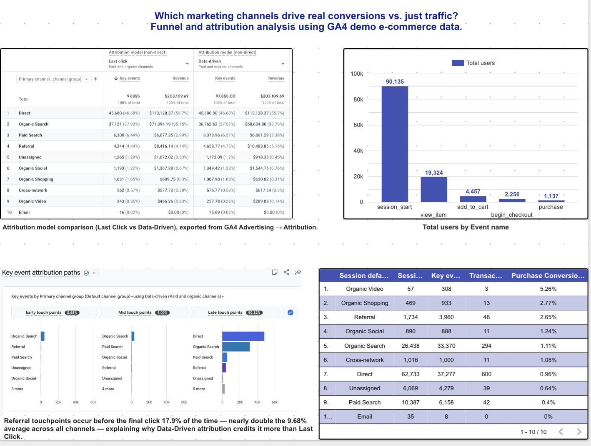

# Which Channels Actually Drive Revenue?

**A funnel and attribution analysis of GA4 e-commerce data**

**Data source:** Google Analytics 4 Demo Account — Google Merchandise Store
**Tools:** GA4 Explorations, GA4 Advertising Attribution, Looker Studio
**Dashboard:** [View the live Looker Studio dashboard](https://datastudio.google.com/reporting/67a830e6-ae0a-49d1-b7db-6feed31e4413)
**Full write-up (.Docx, styled version):** [GA4 Case Study.docx](GA4 Case Study.docx)



---

## The Question

Most teams I've seen lean on last-click attribution because it's the default and it's simple to explain in a meeting: whoever got the final click gets the credit. The problem is that it quietly writes off everything that happened before that last click — the ad someone half-noticed, the search that brought them back a second time, the friend who sent them a link. I wanted to know whether that blind spot was actually hiding anything meaningful in a real dataset, or whether it was a theoretical concern that doesn't change much in practice.

So I picked one channel-level question to chase: which channels look weaker than they really are once you stop counting only the last click?

---

## Method

I worked entirely inside GA4's demo e-commerce property (the Google Merchandise Store), which gave me a real, reasonably large dataset without needing my own site traffic. The approach had three parts:

- Built a purchase funnel in GA4 Explorations — session start through purchase — and broke it down by channel.
- Pulled GA4's built-in comparison of Last Click vs. Data-Driven attribution to see where the two models disagreed on revenue by channel.
- Used GA4's attribution path data to check where each channel actually sits in a user's journey — early, middle, or right before conversion — to explain *why* the models disagreed, not just that they did.

Everything below is pulled directly from the dashboard, built in Looker Studio.

---

## What I Found

### 1. The funnel doesn't leak at checkout — it leaks before anyone even looks at a product

| Stage | Users | % who made it from the prior stage |
|---|---|---|
| Session Start | 90,135 | — |
| View Item | 19,324 | 21.4% |
| Add to Cart | 4,457 | 23.1% |
| Begin Checkout | 2,250 | 50.5% |
| Purchase | 1,137 | 50.5% |

The steepest cliff in this whole funnel is the very first step: roughly four out of five sessions never even get to a product page. Once someone actually reaches checkout, though, they finish the purchase about half the time — which is a genuinely solid completion rate. That tells me the real opportunity here isn't a smoother checkout flow. It's getting more of those early sessions to a relevant product in the first place — better landing pages, better search relevance, that kind of thing.

### 2. Referral is worth more than last-click reporting says it is

| Channel | Last Click Revenue | Data-Driven Revenue | Change |
|---|---|---|---|
| **Referral** | **$8,416.14** | **$10,483.86** | **+24.6%** |
| Paid Search | $6,077.35 | $6,861.29 | +12.9% |
| Direct | $113,128.37 | $113,128.37 | 0% (no upstream channel) |
| Organic Search | $71,394.19 | $68,634.80 | −3.9% |

Referral is the standout here. Under Data-Driven attribution — which spreads credit across a user's whole path instead of handing it all to the last click — Referral's revenue jumps by almost a quarter. That's a real signal that referral traffic is doing more work than a last-click dashboard would ever show: bringing people back, nudging them along, even if it isn't usually the channel that closes the sale.

### 3. Here's why: referral shows up early far more than most channels

The obvious next question was *why*. GA4's attribution path data actually breaks this down — it tags every touchpoint across every conversion path as Early, Mid, or Late (Late meaning the final click before purchase), so you can see exactly where each channel tends to show up.


Hovering over Referral's bar in each of the three panels gives the exact conversion credit behind those percentages:

<table>
<tr>
<td></td>
<td></td>
<td></td>
</tr>
</table>

| Journey stage | All channels (average) | Referral |
|---|---|---|
| Early touchpoint | 5.68% | 14.0% (692.39 of 4,943.32 credits) |
| Mid touchpoint | 4.00% | 3.9% (190.38 of 4,943.32 credits) |
| Late touchpoint (final click) | 90.32% | 82.1% (4,060.55 of 4,943.32 credits) |

Add up Early and Mid, and referral shows up before the final click **17.9%** of the time — against a **9.68%** average across every other channel. That's nearly double. And it's the actual mechanical reason behind Finding 2: last-click attribution structurally can't see any of that early involvement, because it only ever looks at the final touch. Data-driven attribution does see it, which is exactly why it credits referral almost 25% more.

### 4. And referral converts well on its own, independent of any of this

One more check, mostly to see whether this held up outside the attribution modeling entirely: plain conversion rate by channel, sessions to purchase.

| Channel | Sessions | Purchases | Conversion rate |
|---|---|---|---|
| Organic Video* | 57 | 3 | 5.26% |
| Organic Shopping | 469 | 13 | 2.77% |
| **Referral** | **1,734** | **46** | **2.65%** |
| Organic Social | 890 | 11 | 1.24% |
| Organic Search | 26,438 | 294 | 1.11% |
| Cross-network | 1,016 | 11 | 1.08% |
| Direct | 62,733 | 600 | 0.96% |
| Unassigned | 6,069 | 39 | 0.64% |
| Paid Search | 10,387 | 42 | 0.40% |

*Organic Video's rate is based on only 57 sessions — too small a sample to draw much from.

Setting aside that small-sample outlier, referral is the best-converting channel at any meaningful scale — nearly three times Direct's rate, even though Direct brings in far more total revenue. Meanwhile Direct and Paid Search, the two channels with the most traffic, both convert under 1%. Volume and quality clearly aren't the same thing here.

---

## What I'd Tell a Marketing Team

**Stop judging referral by last-click alone.** Its real contribution is roughly a quarter higher than last-click reporting shows, and it converts better than almost anything else at scale. If there's room to invest more in partner or affiliate relationships, this is where I'd start.

**Put optimization effort at the top of the funnel, not checkout.** The checkout-to-purchase step is already working fine. The real loss is upstream — most sessions never even reach a product page, so landing pages and search relevance are the higher-leverage fix.

**Take a harder look at paid search efficiency.** It's pulling in more traffic than almost any channel except direct and organic search, but it converts at the lowest rate of any channel with real volume. Worth checking whether targeting or landing pages are actually matching the intent behind the ads.

---

## A Note on the Data

This uses GA4's public demo dataset, not a live business, so treat the findings as a demonstration of the method rather than advice for an actual company. That said, the process — build the funnel, compare attribution models, and then dig into path-level data to explain any gap you find — carries over directly to any real GA4 property.

---

## Repo Structure

```
ga4-funnel-attribution-analysis/
├── README.md
├── GA4_Case_Study.pdf
└── screenshots/
    ├── dashboard-full.png
    ├── attribution-paths-overview.png
    ├── referral-early-touchpoints.png
    ├── referral-mid-touchpoints.png
    └── referral-late-touchpoints.png
```
